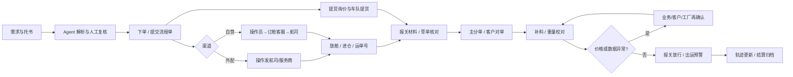

# 空运工单协同系统 Demo — 产品与 UI 设计规范

> 文档状态：Confirmed v0.3，作为 Demo 开发基准\
> 更新日期：2026-08-13\
> 设计基准：1440 × 900 桌面端，兼容 1280px 宽度\
> 业务范围：空运出口工单协同 + 邮箱 Agent 托书收发/解析/下单预填

## 1. 文档目的

本文档是后续 Demo 开发的单一设计基准，统一产品边界、信息架构、流程状态、页面布局、组件、视觉 token 与交互反馈。

本 Demo 不是对现有 BS/CS 系统的等比复刻，而是面向管理者和一线角色展示两个核心价值：

1. 一票空运业务从需求到结算全程可视、可分派、可追溯。
2. 邮箱 Agent 将“发送托书模板 → 等待客户回传 → 解析附件 → 人工复核 → 生成下单草稿”串成一条可解释的流程。

## 2. 已确认的需求理解

### 2.1 工单系统

- 工单主体是一票空运订单/委托，系统内部以“主工单 + 流程节点任务”管理。
- 一个节点必须包含：责任角色、状态、输入材料、待办操作、输出结果、沟通记录、截止时间和异常。
- 流程需要同时支持正常主链与分支：自营/外配、EXW/FOB/FCA、一般贸易/买单报关、单一工厂/一主多单、价格或舱位异常。
- Demo 只提供跟单客服、操作员、订舱客服三个内部角色视角；业务、客户、工厂、车队、报关行、航司和地面服务商均作为外部协作对象。
- 三类内部角色均使用角色名展示，不显示员工实名；邮件演示中的内外部联系人也使用脱敏称呼。

### 2.2 邮箱 Agent

- Agent 在接单阶段生成索要邮件，自动带入收件人、主题、正文和 `Booking 空运模板.xls`。
- 客户/工厂回传托书后，Agent 解析邮件与 Excel 附件，将可用数据映射到下单表单。
- 任何自动提取都是“草稿”，不直接提交订单。低置信度、缺失、冲突和语义转换字段必须由用户确认；只有当前下单页面所需字段全部齐全时，才能创建正式工单。
- 界面必须能回答三个问题：“提取了什么”、“来自哪里”、“为什么需要我确认”。

### 2.3 本轮不做

- 不真实发送邮件，不接入 Outlook/企业邮箱。
- 不真实调用 BS/CS、航司官网、轨迹查询或报关系统。
- 不实现 OCR/大模型服务、用户权限、审批引擎、真实 SLA 计时和生产级审计。
- 不复刻老系统红色顶栏和高密度表单风格；老系统仅作为字段语义参考。
- 运小星 AI 知识库不在本期实现，可作为不可点击的“后续能力”提示，不进入主导航。

## 3. 产品原则

1. **任务优先**：首屏先告诉用户“现在该做什么”，再展示全部业务信息。
2. **一票一视图**：订单信息、责任交接、邮件、附件、异常和操作记录均回到同一工单。
3. **正常简洁，异常醒目**：品牌红用于主操作和当前态；阻塞、超时与冲突使用更深的危险红，并始终配合图标和文字，避免仅靠颜色区分。
4. **AI 可解释、人可控**：不使用“AI 已自动完成”的黑箱表达，重要动作前保留预览和人工确认。
5. **渐进展示**：将长流程拆成五个宏观阶段，详情再展开细节节点，避免用户被超长流程图淹没。
6. **信息只录入一次**：已确认字段在后续节点复用，修改时留下变更记录和影响提示。

## 4. 角色与视角

| 类型 | Demo 中的名称 | 主要职责 | 界面形态 |
| --- | --- | --- | --- |
| 内部角色 | 跟单客服 | 需求受理、托书收发/复核、系统下单、提货询价/确认、通知工厂提货放行、轨迹更新 | 可登录/切换视角 |
| 内部角色 | 操作员 | 渠道判定、订舱任务、进仓要求、报关材料收集与验证、提单制作/对单、补料、申报放行、预警和结算 | 可登录/切换视角 |
| 内部角色 | 订舱客服 | 仅负责自营模式的舱位申请、放舱、航司/地面协同、重量和扫描件回传 | 可登录/切换视角 |
| 外部协作方 | 业务 / 客户 / 工厂 | 发起需求、提供材料、确认价格和对单 | 以沟通记录和凭证出现 |
| 外部协作方 | 车队 / 报关行 / 航司 / 地面服务商 | 提货、报关、承运和地面执行 | 以沟通记录和凭证出现 |

设计中统一使用“订舱客服”，不再使用“跟舱客服”。

## 5. 工单模型与状态

### 5.1 双层模型

- **主工单**：一票业务的稳定容器，包含订单号、路由、贸易条款、渠道、货物摘要、当前阶段、整体风险。
- **节点任务**：某个角色在某个阶段需完成的可操作单元，每个任务只有一名内部责任人，其他人为协作者。上一节点完成后系统自动创建下一任务，由交接人确认具体接手人。

需求邮件到达时由 Agent 生成工单草稿，跟单客服确认需求有效后再转为正式主工单。后续如需代办，同时保留“制度主责”和“实际执行人”。

完成并交接一个节点时，必须通过该节点配置的必填字段、关键附件和外部确认凭证检查。如后续发现早期数据错误，重新打开原节点并保留旧值、新值和返工原因，不新建另一张主工单。

节点任务卡必须具备以下结构：

| 区域 | 内容 |
| --- | --- |
| 标题区 | 节点名称、编号、责任角色、状态、截止时间 |
| 前置输入 | 订单字段、邮件、附件、上一节点的产出 |
| 操作清单 | 1–3 个明确操作，主按钮一次只有一个 |
| 沟通区 | 邮件/企微的模拟记录、收发对象、最新回复 |
| 交付物 | 价格、进仓图、托书、报关材料、主分单、扫描件、放行单等 |
| 异常区 | 异常类型、影响、协同人、处理结论 |
| 审计区 | 谁在什么时间变更了什么 |

### 5.2 主工单状态

`draft` 草稿 → `active` 进行中 → `completed` 已完成。

`exception` 是可与 `active` 并存的风险标记，不替换工单的流程阶段；用户处理异常后可清除标记。

### 5.3 节点状态

| 状态 | 中文 | 界面语义 |
| --- | --- | --- |
| `not_started` | 未开始 | 灰色，前置条件未完成 |
| `in_progress` | 处理中 | 品牌红，当前内部人员正在操作 |
| `waiting_external` | 等待外部 | 青色，等待客户/工厂/车队/报关行/航司回复 |
| `review_needed` | 待确认 | 紫色，等待内部人工复核或批准 |
| `blocked` | 已阻塞 | 红色，缺材料、超时、价格/舱位/数据冲突 |
| `done` | 已完成 | 绿色，产出已固化且可追溯 |
| `skipped` | 已跳过 | 虚线灰色，由分支规则决定不适用 |

禁止用“待处理”一个状态覆盖所有情况；“等对方回复”与“轮到我处理”必须在视觉和数据上分开。

## 6. 流程覆盖

### 6.1 五个宏观阶段

1. **需求与接单**：需求发起、收集托书信息、Agent 解析、下单、提交流程单。
2. **提货与订舱**：车队询价/价格确认/提货，自营或外配订舱，放舱与异常协同。
3. **报关与制单**：报关材料收集、草单核对、工厂确认、主分单制作、客户对单。
4. **补料与出运**：补料、航司重量校对、价格影响、报关放行、预警邮件。
5. **跟踪与结算**：轨迹更新、费用/单价/账单更新、工单归档。

系统下单完成后，提货、报关和提单三条支线并行推进，在“补料核验”汇合。正常等待外部回复不算异常；只有超时、拒绝、冲突、价格变动或资源不可用时才升级为阻塞/异常。Demo 只展示静态截止时间和模拟超时，不实现完整 SLA 引擎。

### 6.2 细节节点清单

| ID | 阶段 | 节点 | 主责 | 关键产出 / 分支 |
| --- | --- | --- | --- | --- |
| 01 | 需求与接单 | 发起下单需求 | 业务/客户 | 工厂联系方式、路由和需求邮件 |
| 02 | 需求与接单 | 发送托书模板 | 跟单客服 + Agent | 带附件的索要邮件，进入等待外部 |
| 03 | 需求与接单 | 收集并解析托书 | 工厂/客户 + Agent | 提取字段、缺失项、冲突项、来源定位 |
| 04 | 需求与接单 | 人工复核并创建下单草稿 | 跟单客服 | 已确认订单字段、操作员、渠道、交货/期望起飞时间 |
| 05 | 需求与接单 | 提交流程单 | 跟单客服 | 外配直达操作员；自营由操作员转订舱客服 |
| 06 | 提货与订舱 | 提货询价、确认与通知放行 | 跟单客服 | 车队报价；EXW 由代理/客户确认，FOB/FCA 由工厂确认；确认后由跟单客服通知工厂提货放行 |
| 07 | 提货与订舱 | 提货与送仓 | 车队 | 提货时间、状态、入仓/异常证据 |
| 08 | 提货与订舱 | 订舱申请 | 操作员 | 外配邮件或自营任务，携带订单摘要 |
| 09 | 提货与订舱 | 放舱与运单号确认 | 订舱客服/航司 | 运单号、进仓图、航班信息 |
| 10 | 提货与订舱 | 订舱异常协同 | 操作员/订舱客服/业务 | 价格变动、无舱位/改期、换航线或重新下单 |
| 11 | 报关与制单 | 进仓及报关要求同步 | 操作员 | EXW/FOB/FCA、一般贸易/买单、多工厂分支文案 |
| 12 | 报关与制单 | 报关材料收集与验证 | 操作员 | 验证工厂提供的发票、箱单、合同、申报要素、委托函等 |
| 13 | 报关与制单 | 报关材料同步与草单核对 | 操作员 | 把验证通过的材料交报关行，跟进草单和工厂确认结论 |
| 14 | 报关与制单 | 主分单录入 | 操作员 | 一主几分单；主单固定发件人/品名，分单使用真实收货人 |
| 15 | 报关与制单 | 客户对单与催复 | 操作员/客户 | 主分单附件、修改意见、有记录的催复 |
| 16 | 补料与出运 | 补料核验与同步 | 操作员 | 主单、分单、舱单、报关单、特殊保函；外配发航司，自营发订舱客服 |
| 17 | 补料与出运 | 航司重量/扫描件校对 | 订舱客服/操作员 | 接收航司最终重量；如影响价格则发起再确认 |
| 18 | 补料与出运 | 报关申报与放行 | 报关行/操作员 | 审结结论、最新报关单、放行单 |
| 19 | 补料与出运 | 出运预警 | 操作员 | 直飞/转飞三字码、航班与预警邮件 |
| 20 | 跟踪与结算 | 轨迹更新 | 跟单客服 | 客户可见的最新节点与异常 |
| 21 | 跟踪与结算 | 账单更新与结算 | 操作员 | 费用、单价、账单已更新，主工单归档 |

## 7. 信息架构

### 7.1 全局导航

| 导航 | 路由建议 | 作用 |
| --- | --- | --- |
| 工作台 | `/workbench` | 当前角色的待办、等待外部、异常和近期完成 |
| 工单中心 | `/tickets` | 所有工单的筛选、搜索、表格列表 |
| 流程看板 | `/process` | 五阶段总览、角色泳道、各节点工单数和阻塞数 |
| 邮箱 Agent | `/mail` | 模板发送、回信收集、附件解析、字段复核与下单预填 |

工单详情使用 `/tickets/:id`；邮件 Agent 的解析复核可使用 `/mail/:messageId/review`，也可从工单中打开全屏抽屉。

### 7.2 全局框架

- 左侧导航宽 232px，支持收起为 72px。
- 顶栏高 64px，左侧显示当前页面和全局搜索，右侧固定放置“Demo 模式”标记、角色切换、通知和用户头像。
- 页面主内容最大宽度 1600px，左右留 24px–32px 边距。
- 角色切换是 Demo 关键控件，切换后待办数、默认筛选、主操作和流程高亮随之变化。
- 跟单客服工作台优先显示托书、提货地址、物流状态、预计入仓、送货、报关/紧急/敏感属性与货重体。
- 操作员工作台优先显示 SA/提单号、航线航班、订舱、毛件体、对单、报关资料、补料、预警与账单。
- 订舱客服工作台优先显示订单/运单、舱位航班、订舱货物数据、入仓实绩、计费重差异和预计盈亏。
- 角色待办的业务编号统一优先展示 `SA 单号`，同时带“起飞港 → 目的港”和航班号；内部工单号保留为系统关联键，不占用待办主信息位。
- 跟单客服工作表将“航班号”设为独立列，并将“提单号 / 起飞目的港”合并展示；货物状态使用业务口径，例如待提货、运抵、放行，不使用含义不明确的生产状态替代物流状态。
- 操作员和订舱客服工作表中的航线均须带航班号；工单详情的“订舱与操作”区域固定展示 SA 单号、主单号、航班号与航班日期。

## 8. 核心页面规范

### 8.1 工作台

目标：10 秒内回答“我现在有哪些事、哪些事在等别人、哪些事有风险”。

布局从上到下：

1. 欢迎区：当前角色 + 一句工作摘要，不使用大面积装饰插画。
2. 四张 KPI 卡：待我处理、等待外部、异常阻塞、今日完成。卡片点击后带条件进入工单中心。
3. 主区域 8/4 栅格：左侧“待办任务”列表，右侧“异常与催办”。
4. 底部“近期工单”紧凑表格，显示订单号、路由、当前阶段、当前责任人、下一截止时间和风险。

待办任务行的主文案必须是动作，例如“复核托书提取的 3 个不确定字段”，不得只显示“订单进行中”。

### 8.2 工单中心

- 顶部筛选条支持：关键字/订单号、宏观阶段、节点状态、责任角色、自营/外配、贸易条款、异常类型。
- 已启用条件在筛选条下方以可删除 chip 显示；不使用隐藏在弹窗内的“默认条件”。
- 默认视图是表格，不是卡片瀑布流。列表需支持整行点击，操作菜单仅放低频动作。
- 表格第一列固定，状态与异常使用图标 + 文字，不只依赖颜色。
- 每页默认 20 条；Demo 可使用本地分页，但交互上保留真实产品形态。
- 工单中心是三个角色工作表的“上帝视角”，字段取跟单客服、操作员、订舱客服工作表的并集并合并同义项，不再使用简化的六列表格。
- 总表采用两级分组表头：核心编号、航线与订舱、提货与物流、订舱/入仓货物、操作与单证、结算与属性、工单控制。
- 每票必须独立展示工单号、SA 单号、提单/运单号；SA 单号不可藏在工单详情或与工单号混成同一字段。
- 总表保留订舱毛件体和入仓毛件体两套数据，并提供独立的入仓差异列；对单、报关资料、补料、预警和账单分列展示。
- 由于字段较多，桌面端使用横向滚动，固定第一列工单号并吸顶两级表头；整行点击打开对应工单详情。

### 8.3 工单详情

详情页是 Demo 的核心页。

**页头**

- 面包屑、工单号/订单号、路由、货物摘要。
- 状态、自营/外配、贸易条款、责任人、最近更新时间。
- 主操作按当前节点变化，例如“复核托书”“确认并交接”“发送催复邮件”。

**阶段导航**

- 页头下方只显示五阶段横向 stepper，保证在 1280px 宽度下可一屏阅读。
- 节点细节放在主内容的纵向时间线中，当前节点自动展开，完成节点默认折叠。

**主内容**

- 8/4 栅格。左侧为流程时间线/当前任务，右侧为上下文边栏。
- 右边栏依次放置：“当前待办”、“订单摘要”、“联系与协作方”、“附件完整度”、“AI 建议”。
- AI 建议卡不置顶、不遮挡当前待办；有建议时显示，无建议时整卡隐藏。

**二级 Tab**

- 流程：默认 Tab，节点时间线。
- 订单信息：结构化运输信息、货物信息、主体信息。
- 单证附件：按“托书/报关/主分单/补料/放行/其他”分组。
- 沟通记录：邮件与企微模拟记录按时间合并。
- 变更记录：字段级旧值/新值、操作人和时间。

**Demo 数据规则**

- 工单中心和三个角色工作台出现的每一个工单号，都必须打开该工单自己的档案；不得复用主演示单的标题、航线、货物、当前节点或页签数据。
- `WO-AIR-20260813-001` 是唯一可随演示动作推进的主演示工单；其流程、责任角色、状态和变更记录随当前演示步骤更新。
- 其他工单使用固定只读档案，用于展示不同阶段和异常场景。每票至少具有独立的订单信息、流程节点、单证附件、沟通记录与变更记录。
- 切换不同工单时，详情默认回到“流程”Tab，避免保留上一票工单的查看位置造成误解。
- 固定工单明确显示“固定演示数据 · 只读展示”；可查看附件摘要和文件元数据，但不模拟真实文件下载或生产级写入。

### 8.4 流程看板

- 默认展示五个宏观阶段的水平流向，每个阶段显示进行中、等待外部、阻塞数。
- 点击阶段后在下方展开角色泳道，而不在同一画布一次性展示 21 个节点。
- 泳道中的节点卡显示责任角色、进行中工单数、超时数和平均停留时长（Demo 使用 mock 数据）。
- 点击节点卡进入已带节点筛选的工单中心。
- 分支线必须标注条件，如“自营”“外配”，不使用无说明的箭头。

## 9. 邮箱 Agent 交互规范

### 9.1 邮箱页面布局

标准邮箱视图为三栏：

- 左栏 300px：邮箱文件夹和邮件列表，待 Agent 处理邮件带紫色星点。
- 中栏自适应：邮件主题、往来人、正文、附件，附件可预览。
- 右栏 380px：Agent 操作与结果，显示当前状态、建议下一步、工具执行记录。

右栏不设置开放式空白聊天框作为主交互，而使用与当前邮件相关的结构化动作：“生成索要邮件”、“解析附件”、“复核并回填”、“追加缺失信息”。

### 9.2 演示流程 A：发送托书模板

1. 用户从工单节点点击“发送托书模板”。
2. 页面进入邮件撰写态，Agent 显示 1–2 秒的分步处理：读取工单上下文 → 选择模板 → 填充收件人与主题 → 附加 Excel。
3. 生成后必须显示完整预览：收件人、抄送人、主题、正文、附件、引用的工单号。
4. 底部固定操作栏：次要“返回工单”、“保存草稿”，主按钮“模拟发送”。
5. 模拟发送后显示 toast，当前节点切换为“等待外部”，并记录发件时间。

模板邮件正文应结构化显示：交货时间/地址/联系人、报关资料由谁提供、报关方式、箱单发票、品牌授权、敏感品申明等问题；但页面不复制老邮件客户端的密集排版。

### 9.3 演示流程 B：回传托书解析与下单预填

1. 用户打开带 `Booking 空运模板.xls` 的客户回信。
2. Agent 右栏显示进度：识别附件 → 读取表格 → 映射下单字段 → 检查缺失和冲突。
3. 完成后进入专用“提取复核”页，不在 380px 边栏中硬塞整张下单表单。
4. 复核页为 5/7 左右分屏：左侧是 Excel 原文预览，右侧是已分组的下单字段。点击任一已提取字段，左侧高亮对应来源单元格。
5. 每个解析字段都提供显式编辑控件，可进入编辑、修改值并保存；编辑结果标记为人工确认。
6. 顶部摘要显示“可直接使用 / 需确认 / 缺失”数量，点击可只看对应字段。
7. 缺失字段可人工填写，也可勾选后点击“生成补充信息邮件”。
8. 底部固定操作栏显示未解决问题数。只有所有必填字段已确认时，“创建下单草稿”才可用。
9. 创建后返回工单详情的“订单信息” Tab，新填字段使用浅紫色“Agent 预填”标签，直到用户提交流程单后转为普通数据。

### 9.4 字段置信度与来源

置信度不向普通用户显示虚假精确的百分比，使用三档语义：

- **可直接使用**：原文有唯一清晰值，格式校验通过。
- **需确认**：存在语义转换、多选一、格式不符合下单要求或与邮件正文冲突。
- **缺失**：托书和邮件中均没有可用值。

每个字段的“查看来源”弹出小型 popover，显示文件名、Sheet 名、单元格/区域或邮件段落、原文值、映射或转换规则。

### 9.5 实际托书样本的字段映射

| 下单字段 | 样本值 / 原文 | 默认判定 | UI 处理 |
| --- | --- | --- | --- |
| 发货人 | YANGZHOU HUACAI OPTO CO., LTD. + 地址 | 可直接使用 | 拆分公司名和地址，保留原文 |
| 收货人 | D S Enterprises + Hyderabad 地址 | 可直接使用 | 拆分公司名和地址 |
| 通知方 | SAME AS CONSIGNEE | 可直接使用 | 显示“同收货人”转换说明 |
| 件数/包装 | 7 CARTONS | 可直接使用 | 拆为数量 7 + 单位 CTNS |
| 毛重 | 92.89 KG | 可直接使用 | 数值与单位分存 |
| 体积 | 0.304 CBM | 可直接使用 | 数值与单位分存 |
| 中文品名 | LED灯带/连接器/堵头 | 可直接使用 | 并列展示，不擅自归并 |
| 英文品名 | LED STRIP/CONNECTOR/ENDCAP | 可直接使用 | 保留大小写和分隔符 |
| HS Code | 940542/940599/940599 | 可直接使用 | 拆分为可编辑 tag，与品名一一核对 |
| 贸易条款 | EXW | 可直接使用 | 驱动提货价格确认分支 |
| 货好时间 | 已完工 | 需确认 | 仅可作为“货物状态”，不能自动填入日期字段 |
| 报关方式 | 表格同时列出“一般贸易 / 买单报关” | 需确认 | 如无明确勾选证据，不根据排版猜测 |
| 起运机场 | 未填 | 缺失 | 必填阻塞项，可生成补信邮件 |
| 目的机场 | 未填；收货地址出现 Hyderabad | 需确认 | 可提示“可能为 HYD”，严禁自动提交 |
| 包装尺寸 | 未填 | 缺失 | 如业务要求尺寸，作为必填阻塞项 |
| 品牌 / Logo | 未填 | 缺失 | 不以品名推测 |
| 敏感品申明 | “是/否”未见明确选择 | 需确认 | 作为安全关键字段，未确认不得创建可提交订单 |
| 提货地址/联系人 | 未填 | 缺失 | 当需要提货时动态转为必填 |

## 10. 视觉语言

### 10.1 设计方向

关键词：**中技品牌、航运控制塔、专业可信、信息密度适中、清晰协作、克制的 AI 感**。

整体配色参考《中技 PPT 模板-ai 与数字化中心》：以中技品牌红 `#DC2020` 为主色，搭配深红导航、暖白内容面和低饱和浅粉背景。主按钮、当前步骤、链接和关键数据使用品牌红；大面积内容区保持明亮克制，通过浅红渐变和低透明度品牌纹理形成统一识别，不复刻旧系统的高密度红色顶栏，也不使用霓虹渐变、玻璃拟态或过度卡片化。

品牌红同时承担“当前态”语义，因此异常状态不得只显示红色：阻塞与超时使用更深的危险红，并配合警示图标、明确文案和边框；等待外部、成功、待确认和 Agent 仍使用独立语义色。

### 10.2 颜色 token

| Token | 色值 | 用途 |
| --- | --- | --- |
| `--nav-900` | `#7B1116` | 左侧导航、深色品牌面 |
| `--nav-800` | `#98171B` | 导航渐变与悬停层 |
| `--primary-700` | `#B5161B` | 主按钮悬停、强调链接 |
| `--primary-600` | `#DC2020` | 主按钮、当前步骤、链接、关键数据 |
| `--primary-100` | `#F7CACA` | 当前态描边、进度环 |
| `--primary-50` | `#FFF0F0` | 选中背景、浅品牌信息区 |
| `--cyan-600` | `#1F7772` | 等待外部、协同中 |
| `--ai-600` | `#7E1FAD` | Agent 操作、Agent 预填标识，仅局部使用 |
| `--success-600` | `#34845F` | 已完成、已核验 |
| `--warning-600` | `#A65312` | 待确认、临近超时、价格变动 |
| `--danger-600` | `#8F1519` | 阻塞、超时、确认冲突；必须配图标和文字 |
| `--text-900` | `#2A0B06` | 标题与正文主色，取自模板深色文字 |
| `--text-600` | `#6F5552` | 次要信息 |
| `--text-500` | `#806966` | 辅助文字、时间和元数据 |
| `--line-200` | `#E7D8D6` | 边框和分隔线 |
| `--surface-0` | `#FFFFFF` | 主内容面 |
| `--surface-50` | `#FCF8F8` | 暖白偏粉页面背景 |

所有语义色均需有 50/100 阶浅色背景和 600/700 阶文字/图标色，不使用低对比度彩色文字。

品牌红的使用面积遵循“深红导航 + 红色操作点 + 大面积暖白”的比例；表格、表单和邮件正文以白色为主，不整块铺满高饱和红。章节横幅或主演示 Banner 可使用 `#8F1117 → #DC2020 → #ED4B45` 的品牌渐变，并以浅粉波纹或圆弧作为低对比装饰。

### 10.3 字体与字号

- 中文：`PingFang SC`, `Microsoft YaHei`, sans-serif。
- 英文与数字：`Inter`，缺失时回退至系统 sans-serif。
- 页面标题 24/32px，卡片标题 16/24px，正文 14/22px，辅助文字 12/18px，KPI 数字 28/36px。
- 正文默认 400，标题 600，只在 KPI 或重要状态使用 700。
- 订单号、运单号和时间可使用 tabular numerals，但不使用等宽字体显示大段正文。

### 10.4 间距、圆角和阴影

- 基础间距单位 4px，常用间距 8/12/16/24/32px。
- 按钮高 36px，主要表单控件高 40px，紧凑表格行高 48–56px。
- 卡片圆角 12px，表单控件 8px，标签 6px，胶囊标签使用 999px。
- 主卡片默认只用 1px 边框；悬浮层/抽屉才使用柔和阴影 `0 12px 32px rgba(17, 31, 51, 0.12)`。
- 禁止每张卡都加浓重阴影，禁止在一个页面中混用多种圆角。

### 10.5 图标与图表

- 使用统一 1.75–2px 线性图标，不混用 emoji 与拟物 3D 图标。
- 图标不单独承担状态含义，必须配文字或 tooltip。
- 图表只用于趋势、分布和阶段拥堵等真正有比较价值的场景，工作台不堆放装饰性环图。

## 11. 通用组件规范

### 11.1 按钮

- 一个局部容器内只保留一个主按钮。
- 按钮层级：Primary（主操作）、Secondary（普通操作）、Tertiary/Text（辅助）、Danger（高风险）。
- 高风险或不可逆操作要求二次确认；Demo 中的“模拟发送”和“创建草稿”不弹确认窗，但需先有预览。
- 加载时按钮保持宽度，文案改为动作进行式，如“正在解析附件…”。

### 11.2 标签与状态

- 状态 Tag 包含 6px 小圆点 + 文字，高度 24px。
- 业务属性 Tag（EXW、自营、普货）使用中性边框，不与状态色竞争。
- Agent 标签只标注 Agent 实际参与的字段或操作，不对整页泛化使用紫色。

### 11.3 表单

- 长表单按“运输信息 / 货物信息 / 主体信息 / 服务与报关 / 附件”分组。
- 宽屏默认两列，多行文本和文件上传占满整行；不重现老系统四列密集表单。
- 必填标识放在 label 后，错误说明放在字段下，不使用只有红色边框的无文字错误。
- 字段修改如会影响分支，例如 EXW 改为 FOB，保存前在字段下方显示影响提示。

### 11.4 附件

- 附件行显示文件类型图标、文件名、大小、来源人、上传/收取时间、业务分类。
- 主操作是预览，其次是下载和查看来源邮件。
- 上传、Agent 解析和人工确认是三个独立状态，不使用一个“已处理”统称。

### 11.5 抽屉、弹窗和 toast

- 不离开上下文的处理（查看节点、快速分派、预览邮件）使用 480–640px 抽屉。
- 需要完整注意力的处理（托书提取复核、主分单大表单）使用独立页，不使用超宽 modal。
- toast 用于短暂的成功反馈；任务状态变化必须在页面本体也可见，不能只出现在 toast。

### 11.6 空、加载、错误状态

- 骨架屏应与最终布局结构一致，避免整页 spinner。
- 空状态说明原因与下一步，例如“还没有收到工厂回传的托书，可发送催复邮件”。
- 邮件解析失败时保留附件预览和人工填写通道，不将 Agent 失败等同于工单无法继续。
- 错误文案必须面向业务动作，例如“未识别到目的机场，请选择机场或向客户补问”，不直接暴露技术错误码。

## 12. 动效与微交互

- 普通悬停/选中：120–160ms ease-out。
- 抽屉/阶段展开：200–240ms ease-out。
- Agent 演示使用真实分步文案和进度变化，总时长控制在 1.5–3 秒，不制造 10 秒以上的假等待。
- 流程节点完成时可使用一次轻量的 check 动画，不使用彩带、弹跳等娱乐化效果。
- 使用 `prefers-reduced-motion` 关闭非必要动效。

## 13. 响应式与可用性

- 开发与验收主视口为 1440 × 900，必须额外验证 1280 × 800。
- 1280px 以下左导航默认收起，工单详情右边栏可折叠。
- 邮箱三栏在宽度不足时，Agent 边栏转为右抽屉；提取复核页仍保持左右分屏并允许拖动分割线。
- Demo 不以手机为主展示设备，但在 <768px 下不得崩溃：列表可转卡片，复杂编辑提示在桌面端完成。
- 所有可交互元素支持键盘聚焦，焦点环使用 2px `--primary-600`，不可只有 hover 反馈。
- 正文和背景对比度至少 4.5:1；大字至少 3:1。
- 状态使用颜色 + 图标 + 文字三重表达。

## 14. Demo 数据与演示脚本

### 14.1 主演示工单

建议使用一票基于实际托书样本的脱敏工单：

- Demo 工单号：`WO-AIR-20260813-001`。
- 发货人：YANGZHOU HUACAI OPTO CO., LTD.
- 收货人：D S Enterprises（Hyderabad, India）。
- 货物：7 CARTONS / 92.89 KG / 0.304 CBM。
- 品名：LED 灯带、连接器、堵头；贸易条款 EXW。
- 在 Agent 复核时保留真实缺失：起运机场、目的机场、尺寸、品牌、敏感品声明、有效货好日期。

不为了让演示“全绿”而伪造自动提取结果；缺失项本身是展示 Agent 安全边界的关键剧情。

### 14.2 辅助工单

至少再准备 5 票 mock 工单以填充工作台和流程看板：

1. 外配订舱待航司回复。
2. 自营订舱已放舱，待同步进仓图。
3. 一般贸易报关缺申报要素，节点阻塞。
4. 航司最终重量变动造成价格异常，待业务确认。
5. 已报关放行，待发送出运预警。
6. 运输完成，待账单更新结算。

### 14.3 推荐演示路径（5–7 分钟）

1. 在工作台切换“跟单客服”，点开“待收集托书”工单。
2. 从工单发起“发送托书模板”，预览并模拟发送。
3. 打开客户回信，观看 Agent 解析 Excel 附件。
4. 进入提取复核，点击几个字段查看来源，展示“目的机场”和“敏感品声明”需人工确认。
5. 模拟补齐必填项，创建下单草稿，返回工单。
6. 在工单详情展示五阶段、当前任务、邮件/附件证据和变更记录。
7. 切换“操作员”或“订舱客服”角色，显示同一工单在不同视角下的下一个待办。
8. 打开流程看板，交代全链路覆盖和异常工单定位能力。

## 15. 开发实现约束

- 所有页面使用共享的 token，禁止在业务组件中散落硬编码颜色、阴影和间距。
- 核心组件应该复用：`StatusTag`、`RoleBadge`、`TicketHeader`、`StageStepper`、`TaskCard`、`AttachmentRow`、`AuditTimeline`、`SourceEvidence`、`AgentActionCard`、`ConfidenceState`。
- Mock 数据与页面解耦，工单、节点、邮件、附件和角色使用稳定 ID 关联，不在组件中通过文案匹配状态。
- Demo 操作必须有可见的状态迁移：发邮件后进入等待外部，收到回信后进入待复核，创建草稿后更新工单。
- 页面刷新后 Demo 状态应保留（可用 localStorage），并提供“重置演示数据”。
- 复杂表格、邮件正文和文件名需要使用接近真实的中英文内容，不使用 Lorem ipsum。
- 业务规则与 Demo 剧情分离：流程节点与分支条件用配置表表达，不将顺序写死在页面结构中。

## 16. 验收标准

### 16.1 流程覆盖

- 用户能在流程看板或工单详情中找到本文第 6.2 节的全部 21 个节点。
- 用户能分辨每个节点的责任角色、当前状态、前置输入与产出。
- 自营/外配、EXW/FOB/FCA、一般贸易/买单分支在流程中有文字标注。

### 16.2 邮箱 Agent

- 可从工单发起托书模板邮件，查看完整预览并模拟发送。
- 可打开带托书附件的模拟回信并触发解析。
- 提取复核页区分“可直接使用 / 需确认 / 缺失”，且字段可反向定位原文。
- 未确认必填字段时无法创建可提交的下单草稿，但可保存当前复核状态。
- 创建草稿后工单信息、节点状态和审计记录同步更新。

### 16.3 视觉与交互

- 1440 × 900 与 1280 × 800 下无主要内容裁切、横向溢出或操作遮挡。
- 主按钮层级清晰，状态不只靠颜色，键盘可访问核心流程。
- 工单、邮件和 Agent 页面属于同一视觉系统，不得分别呈现为三套不相关的模板。
- 所有模拟动作都有加载、成功或可恢复的失败反馈。

## 17. 已确认的 Demo 决策

1. Demo 的说服对象同时覆盖管理层和一线人员，但演示叙事优先面向管理决策。
2. 只有跟单客服、操作员、订舱客服登录系统；业务的确认由内部人员录入结论和凭证。
3. Demo 覆盖到轨迹更新和账单结算，但不展开上线级结算规则。
4. 主演示使用自营模式，通过另一票工单和流程看板补充外配分支。
5. 一票业务对应一个主工单，每次岗位交接产生独立节点任务。
6. 邮箱 Agent 以工单节点内操作为主，同时保留邮箱入口用于展示新邮件到达和 Agent 待处理队列。
7. 下单表单沿用现有 BS 系统的字段和分组语义，但采用新的现代 UI，不等比复刻老系统。
8. 节点主责岗位固定，但允许记录代办人；节点只有一名内部责任人。
9. 节点任务自动生成，交接人确认具体接手人；完成时检查必填字段、附件和凭证。
10. 外部沟通默认由内部人员录入结论和凭证；邮件 Agent 场景可自动关联邮件。
11. 提货、报关、提单三条支线并行，在补料核验汇合。
12. 正常外部等待与异常分开；仅超时或出现明确问题时升级阻塞。Demo 只使用模拟截止时间。
13. 返工重新打开原节点并保留变更记录，不创建新主工单。
14. 报关材料由操作员验证；工厂提货放行由跟单客服通知。
15. 开发优先级是“一条演示流程完整跑通”，不追求上线级权限、SLA、配置和异常覆盖。

## 18. 资料来源

- 飞书 Wiki：[客服操作中心调研报告](https://wcn5x10dhcm7.feishu.cn/wiki/Rk8Fwq6yviZQXokbOZ5caBoCnsb)。
- 飞书 Wiki：[客服操作中心调研记录模板](https://wcn5x10dhcm7.feishu.cn/wiki/JS6sw1EFoiWRsrko6eqcw8RVnP6)，本文优先使用该表的细节节点。
- 飞书报告中的补充流程画板，用于核对从下单、订舱到结算的主链。
- 本地样本：`托书/Booking 空运模板.xls`。
- 用户提供的两张截图：托书模板索要邮件、现有下单系统中的运输与货物字段区。
